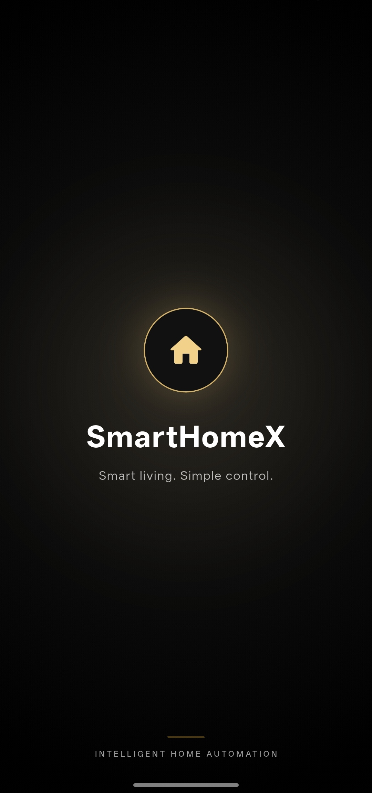
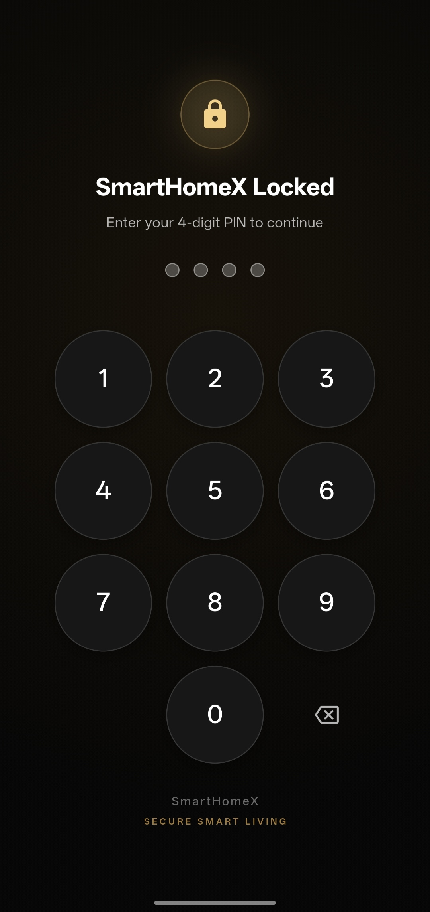
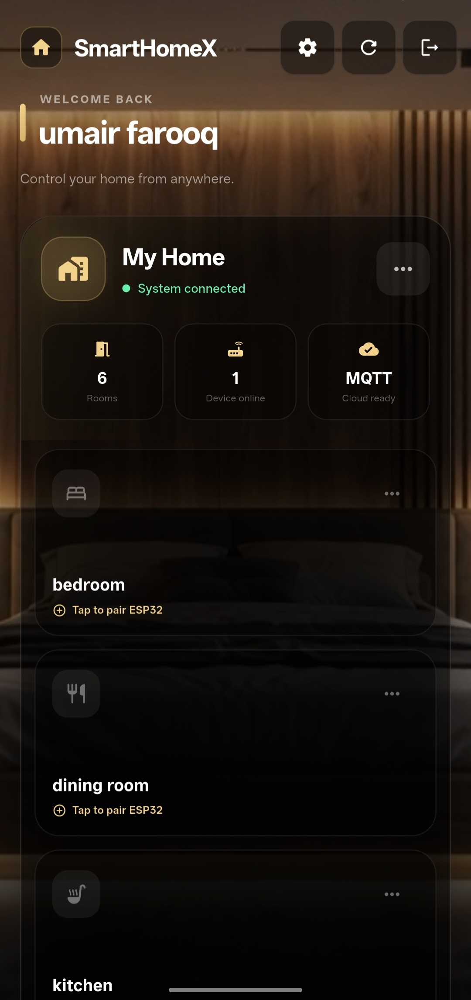
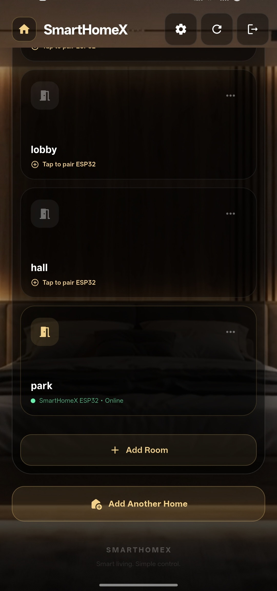
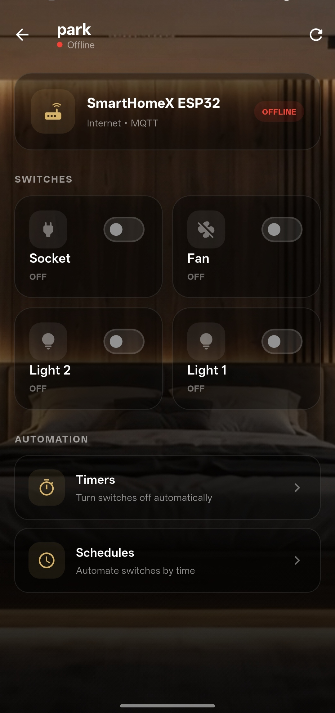
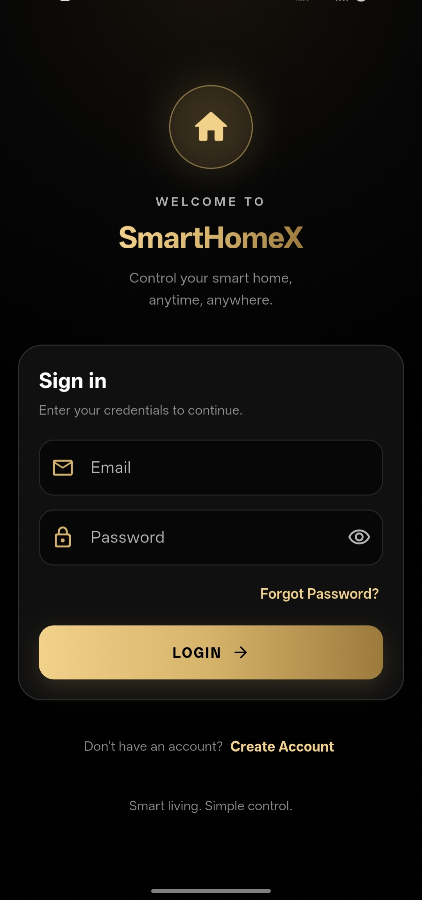

Smart home automation platform using Flutter, ESP32, MQTT, and Supabase.
## Project structure

```text
smarthomex/
├── android/                 # Android application and Gradle configuration
├── assets/
│   ├── certificates/         # MQTT/TLS certificate
│   └── videos/               # App intro video
├── ios/                     # iOS application and Xcode configuration
├── lib/                     # Flutter/Dart application source
│   ├── core/                 # Theme, colors, routes, and shared constants
│   ├── models/               # Device, relay, schedule, and timer models
│   ├── providers/            # App state providers
│   ├── screens/              # App lock, auth, home, schedules, settings, setup, splash, timers
│   ├── services/             # API, auth, device, MQTT, storage, Wi-Fi, schedule, and timer services
│   ├── utils/                # Shared utilities and validators
│   ├── widgets/              # Reusable UI widgets
│   └── main.dart             # Application entry point
├── linux/                   # Linux runner and Flutter platform integration
├── macos/                   # macOS application and Xcode configuration
├── test/                    # Automated tests
├── windows/                 # Windows runner and Flutter platform integration
├── analysis_options.yaml    # Dart analyzer configuration
├── pubspec.yaml             # Flutter package and asset configuration
├── pubspec.lock             # Locked package versions
└── README.md
```







